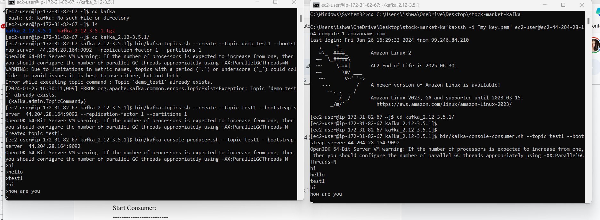

# Stock Price Analysis Using Kafka on AWS

## Project Overview

This project involves real-time streaming of stock market data using Kafka server on AWS infrastructure. The main components utilized in this project are AWS services, Kafka, and related tools.
## Architecture 


## Technology Used
- Programming Language - Python
- Amazon Web Service (AWS)
1. S3 (Simple Storage Service)
2. Athena
3. Glue Crawler
4. Glue Catalog
5. EC2
- Apache Kafka

### Broker Basics

- **Producer**: Sends messages to brokers.
- **Brokers**: Receive and store messages.
- **Kafka Cluster**: Can have many brokers.
- **Partitions**: Each broker manages multiple partitions where data are replicated.

### Consumer Basics

- **Consumers**: Pull messages from one or more topics.
- New inflowing messages are automatically retrieved.
- **Consumer Offset**: Represents the position of a consumer within a partition.

## Setup Instructions

I have attached command.txt file for instruction follow that.

# Kafka Producer and Consumer for Loading Data into S3

This repository contains Python files for a Kafka producer and consumer, designed to load data into Amazon S3 buckets.

## Usage

1. **Setup Kafka Environment**:
   - Ensure a running Kafka environment with defined topics.

2. **Configure AWS Credentials**:
   - Set up AWS credentials for S3 access.

3. **Run Kafka Producer**:
   - Execute `kafka_producer.py` to generate and publish data to Kafka.

4. **Run Kafka Consumer**:
   - Execute `kafka_consumer.py` to consume Kafka data and load it into S3.


## Additional Instructions for AWS Glue and Athena
To access Amazon S3 from your local machine, follow these steps:

1. **Create an IAM User**:
   - Create an IAM user with administrator policy attached in the AWS Management Console.

2. **Generate Access Key**:
   - Navigate to the IAM dashboard, select the created user, and generate an access key.
   - Download the access key CSV file containing the access key ID and secret access key.

3. **Configure AWS CLI**:
   - Open a command prompt or terminal on your local machine.
   - Run the following command and provide the access key ID, secret access key, region, and output format when prompted:
     ```
     aws configure
     ```

4. **Create Crawlers in AWS Glue**:
   - In the AWS Glue console, create crawlers to analyze and extract schema from your data stored in S3.

5. **Use AWS Glue to Create and Run Queries**:
   - Utilize AWS Glue to define, manage, and run extract, transform, and load (ETL) jobs for your data.

6. **Use Athena to Query Data**:
   - Access the AWS Athena console and execute SQL queries to analyze data stored in your S3 buckets.
  
### Output file 
  


